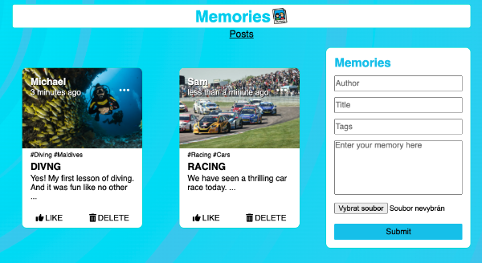

# Memories

This is simple app built to learn new stuff. In this case MERN stack.
It allows you to record memories to the database.

## Inspiration

Following [JavascriptMastery](https://github.com/adrianhajdin/project_mern_memories) repo serves as an inspiration. However I'm using slightly different technology. And the Redux stuff is my creation.

## Screenshot

## Features

You can add, delete and update posts. You can also upload one image for each memory.

## TODO

- Likes. Button is here, but it awaits for implementation. 
- Tags. You can enter some hashtags but filtering is not ready yet. 
- Users. The most importatnt thing. You cannot use different user's profiles right now. I have to figure out authentication mechanisms in the first place.

## Tech/framworks used

- React 
- Styled components 
- React Redux 
- React-router-dom 
- FontAwesome

## Run application

Application works with this (express server)[https://github.com/jurashek-king/memories-backend.git].

Clone this repo with `git clone`. 
After cloning run `npm install` to install all dependencies. 
At last, run `npm start` to run the application in the development mode. 
Open [http://localhost:300](http://localhost:3000) to view it in your browser.